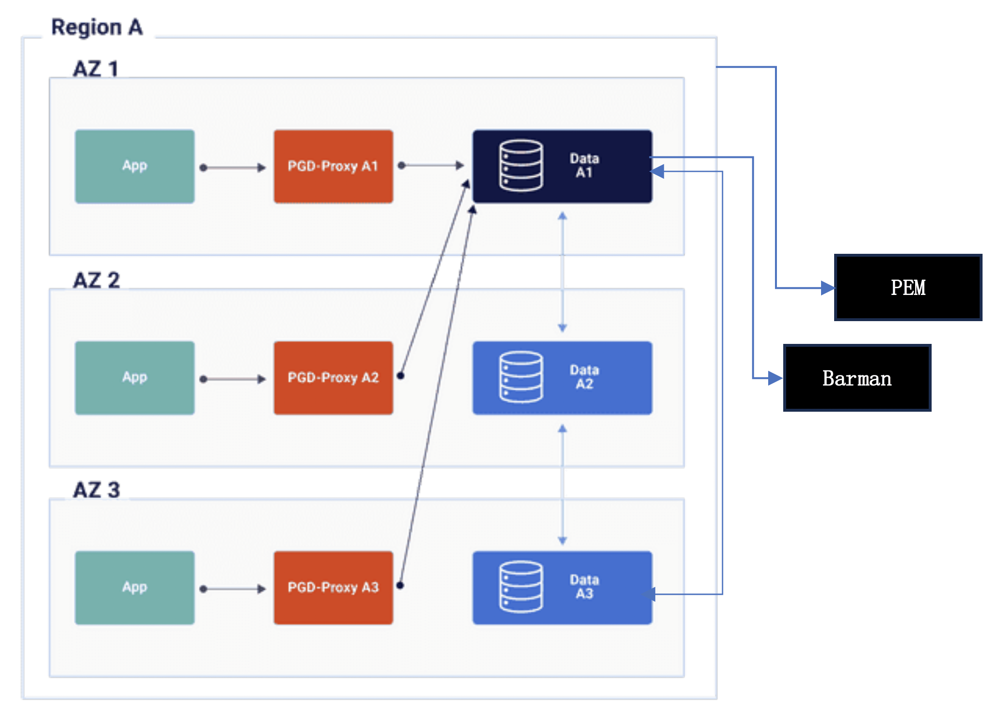
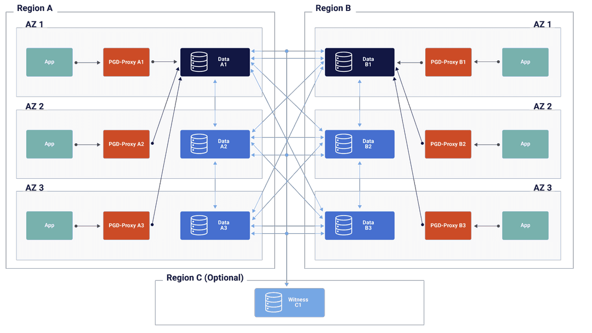

## 下一代 Postgres 高可用解决方案 

## EDB Postgres Distributed分布式Always On架构##

在当今的数字化时代，数据的重要性不言而喻，而数据库的稳定性和可用性则是保障数据安全和业务连续性的关键。PostgreSQL及其衍生的国产数据库解决方案如同春日里的百花，竞相绽放，为企业提供多种高可用解决方案。然而，尽管市面上的高可用性（HA）解决方案众多，如基于pgPool-II、Patroni、pgBouncer以及HAproxy和Keeplive等实现PostgreSQL的高可用性，大多数仍旧采用一主多备（复制）的实现模式。这样的架构虽然在一定程度上保障了系统的稳定性，但在故障切换时仍可能出现服务中断。此外，在数据库版本升级和维护期间，服务的暂停也是一个不容忽视的问题，特别是在对连续性要求极高的在线事务处理（OLTP）业务场景下，传统的HA解决方案难以满足99.999%的高可用性要求。

为满足这些挑战，向大家介绍一种超级高可用性解决方案------EDB Postgres Distributed（简称PGD）。PGD不仅打破了传统数据库的局限性，更进一步基于PostgreSQL实现了真正的multi-master架构、active/active部署、单/多位置（数据中心）以及极致高性能的extreme HA解决方案。

### 引言 

在过去5年中，高可用性（HA）的定义已经发生了变化。HA曾经是指保护用户免受硬件故障、网络问题和软件故障影响的技术。今天，HA技术是要确保软件服务始终在线------每年365天，每天24小时。HA产品仍然是保护用户免受故障的影响，但随着硬件、网络、电源和存储设备变得更加可靠，近乎零停机时间的维护和管理已经成为HA讨论的前沿。近乎零停机时间，或者说"始终在线"，已经成为全球经济发展中成功实现数字化转型的必备条件。

EDB Postgres Distributed（PGD），以前称为Postgres-BDR或BDR，有广泛的可能应用场景，例如主数据管理、分片和数据分发。

EDB Postgres Distributed(PGD)也可用于本文描述的场景之外的架构。特定场景的用例已成功部署在生产环境中；但是，此类场景变体必须首先经过严格的体系结构审查，并且应启用EDB 的 Always On 体系结构 Trusted Postgres Architect （TPA）的标准部署工具来支持，然后才能部署在生产环境中。

### 始终在线架构 Always On Architectures

EDB Postgres Distributed（PGD）始终在线架构是一套高度标准化、经过验证和可靠的Postgres架构，用于在本地或公共云中实现高达99.999%的数据库可用性。

通过标准化的架构，支持具有不同冗余级别的**单一位置（数据中心）**或**多位置（数据中心）**部署，并根据您的RPO（恢复点目标）和 RTO（恢复时间目标）要求提供不同级别的冗余。

Always On架构使用三个数据库节点组作为基本构建块。您还可以使用五个节点组来获得额外的冗余。

PGD由两个关键组件组成：

-   双向复制 (BDR) --- 一个 Postgres扩展，协调分布式集群，包括事务复制、持久性、节点管理等。
-   PGD-Proxy代理 --- 提供一个连接路由器，确保应用程序连接到正确的PGD节点。

Always On架构能在多种故障情况下提供保护。根据所需的容错能力，Always On架构可以重新配置和扩展，以满足更大范围的容错需求。例如，具有两个数据节点的单个数据中心架构可以防止本地硬件故障，但不提供位置故障（数据中心或区域）的保护。扩展该架构到不同位置的备份可以确保在位置发生灾难性损失时提供某种保护，但数据库仍需从备份中恢复，这可能违反RTO要求。通过增加第二个活动位置，用户可以确保即使一个位置（数据中心或区域）离线，服务仍然可用。最后，可以向任何架构添加订阅（subscriber）节点，以平衡并减轻读取工作负载，来满足报告、归档和分析需求。

每个配置都可以提供**零RPO**，因为数据可以同步流式传输到至少一个本地副本，从而保证在本地硬件故障情况下零数据丢失。提高可用性保证总是会增加硬件和许可证成本、网络要求和操作复杂性。因此，在选择合适的架构之前，仔细考虑可用性和合规性要求非常重要。

### 架构细节

默认情况下，应用程序事务不需要集群范围的共识来进行DML（选择、插入、更新和删除），这允许更低的延迟和更好的性能。然而，对于某些操作，例如生成新的全局序列或执行分布式DDL，PGD需要一个奇数节点数来使用基于 Raft的共识模型做出决策。因此，最简单的Always On架构也需要有三个节点，即使并非所有节点都存储数据。

应用程序通过多主机连接标识连接到标准 Always On 架构，其中每个PGD-Proxy服务器是多主机连接标识中的一个独立条目。每个位置应始终至少有两个代理节点以确保高可用性。代理可以与数据库实例位于同一主机节点，在这种情况下，建议在每个数据节点上都部署代理。

-   **Always On单一位置（数据中心或区域）架构**

 

  1. 冗余硬件，快速从本地故障中恢复
     * 3 个 PGD 节点
        * 可能是 3 个数据节点（推荐），或 2 个数据节点和 1个witness（仲裁）节点，后者不保存数据（图中未示出）
     * 每个数据节点都有一个 PGD-Proxy，与应用程序保持亲和性
        * 可以与数据节点共置同一主机
  2. Barman用于备份和恢复
     * 可以被多个集群共享
  3. Postgres Enterprise Manager（PEM）用于监控
     * 可以被多个集群共享

-   **Always On Multi Location多数据中心架构**

 -   应用程序可以在每个位置（数据中心）为主动/主动，也可以是主动/被动或者主动DR（只有一个位置进行写入）。
 -   未画出数据节点1和3之间的复制，但作为复制网格的一部分在进行。
 -   冗余硬件，可从本地故障中快速恢复.
   -   总共 6 个 PGD 节点，每个位置 3 个
     -   可以是3个数据节点（推荐）
     -   可以是 2个数据节点和1个不保存数据的见证节点（图中未示出）
 -   每个数据节点有一个 PGD-Proxy，与应用程序保持亲和性
     -   可以与数据节点位于同一位置（推荐）
     -   可以位于单独的节点上
   -   数据节点和位置的配置和基础结构对称性应确保在重新路由时有适当的资源可用于处理应用程序工作负载
-   Barman用于备份和恢复（图中未示出）.
  -   可由多个 PGD 集群共享
-   Postgres Enterprise Manager (PEM)用于监控（图中未示述）.
  -   可由多个 PGD 集群共享
-   一个可选项是将见证节点放置在第三个位置（数据中心或区域）中，以提高对位置（数据中心或区域）故障的容忍度.
  -   否则，当一个位置发生故障时，需要全局共识的操作将被阻止，例如添加新节点和分布式DDL。

### 如何选择正确的架构

所有体系结构都提供以下功能：

-   硬件故障保护

-   零停机升级

-   支持公共/私有云中的可用区

使用下面这些标准可以帮助您选择合适的 Always On 架构。

- 通过连续增加3节点组到cluster，常规可以增加到3到5个位置（数据中心或区域）。只是在2个位置（数据中心或区域）的环境中才建议增加配置witness（见证）位置（数据中心或区域）。
- 如果仅使用 2 个数据节点和 1 个见证节点，那么本地恢复时间将涉及到恢复HA 的时间，包括配置额外虚拟机（VM）的时间，以及每 500GB 数据恢复大约60 分钟的时间。

### 部署和配置尺寸考虑因素

对于生产环境部署，EDB建议每个PGD数据节点至少分配4个核。见证节点（witness）不参与数据复制操作，无需满足此要求。逻辑备用节点应始终与PGD数据节点配置相同，以避免节点提升时性能下降。在生产环境部署中，PGD Proxy节点至少需要1个核心，作为经验法则，它们应与数据库核数的增加成比例增加，大约是1:10 的比例。EDB建议进行详细的基准测试，以确定基于您的工作负载的适当配置尺寸。如果需要，EDB专业服务团队可以提供协助。

对于开发目的，PGD 数据节点不应分配少于2个核。Barman节点的尺寸取决于数据库大小和数据变更速率。

PGD节点、Barman节点和 PGD Proxy节点可以部署在虚拟机上或裸机部署模式。然而，必须保持各种亲和性和反亲和性属性：

-   多个PGD数据节点和见证节点不应位于同一物理硬件上的VMs
    上，因为这会降低弹性。
-   多个 PGD Proxy 节点不应位于同一物理主机的VMs上，因为这会降低弹性。
-   单个 PGD Proxy 节点可以与单个 PGD 数据节点共置，当它们作为 VMs 部署时。

### 为标准架构增加灵活性

单位置架构可以部署在尽可能多的地点，以提供所需的数据弹性和靠近应用程序和用户的数据。虽然PGD提供了多种冲突处理方法，但通常应尽量减少允许从地理上不同地点进行写操作时预期的冲突数量。

标准架构还可以通过两种类型的节点进行扩展：

-   仅订阅节点（Subscriber only）

-   逻辑备用（Logical standbys）

**仅订阅节点（Subscriber only）**可用于实现额外的读取可扩展性，并在应用程序的工作负载主要是读取密集型且写入不频繁时，将数据更接近用户。它们还可以用于发布数据子集，以满足报告、归档和分析需求。
**逻辑备用（Logical standbys）**从 PGD集群中的另一个节点接收复制的数据，但不参与复制网格或共识。它们包含与其它PGD数据节点相同的所有数据，并且可以快速提升为主机，以使集群恢复到完全容量/共识。它们可以用于数据中心之间网络流量成为问题的环境下；否则，每个地点始终推荐3个PGD 数据节点。

### 结论

PGD提供标准的 Always On架构，以支持不同程度的可用性要求，从单地点架构到包括冗余硬件组件的多地点架构。Always On架构根据所需的数据中心或区域数量具有适应性，并可扩展以实现更快的故障恢复和额外的下游需求。这些架构已在生产中得到验证，并利用 EDB Postgres分布式的逻辑复制和基于网格的架构，实现了在公有和私有云部署中高达> 99.999% 的行业领先的 Postgres 可用性。
